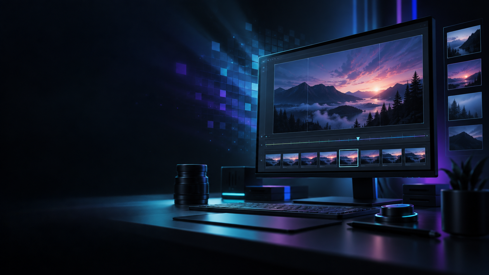
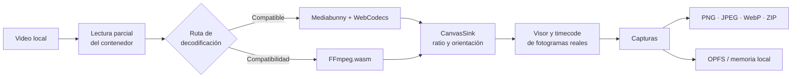
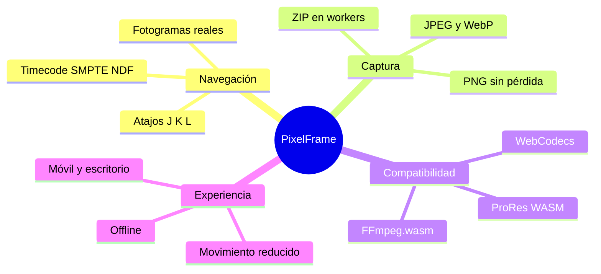

<p align="center">
  
</p>

<h1 align="center">PixelFrame</h1>

<p align="center">
  Extrae el fotograma exacto. Conserva el control creativo.
</p>

<p align="center">
  <a href="https://github.com/KennethOlivas/pixel-frame/actions/workflows/ci.yml"></a>
  <a href="https://github.com/KennethOlivas/pixel-frame/blob/main/LICENSE"></a>
  <a href="https://github.com/KennethOlivas/pixel-frame/stargazers"></a>
  <a href="https://github.com/KennethOlivas/pixel-frame/network/members"></a>
  <a href="https://github.com/KennethOlivas/pixel-frame/releases"></a>
</p>

<p align="center">
  
  
  
  
</p>

---

## El fotograma que buscas, sin subir tu video

**PixelFrame** es una herramienta de extracción de fotogramas para el navegador. Abre archivos locales, navega por timestamps de presentación reales y exporta PNG, JPEG o WebP a su resolución de visualización nativa. No hay cuentas, servidor ni subida de contenido: tus medios permanecen en tu equipo.

| Precisión | Privacidad | Exportación |
| :---: | :---: | :---: |
| Marcas de presentación reales, incluidas B-frames | Archivos procesados íntegramente en el navegador | PNG, JPEG, WebP y ZIP |

## Arquitectura



## Lo esencial, de un vistazo



## Inicio rápido

Requisitos: Node.js 22 o posterior y npm.

```sh
npm install
npm run dev
```

Después abre la URL indicada por Vite. Para validar la compilación de producción:

```sh
npm run build
npm test
```

## Versiones

Las versiones siguen Semantic Versioning. Consulta [CHANGELOG.md](CHANGELOG.md) para novedades y [VERSIONING.md](VERSIONING.md) para el proceso de publicación.

Abre la URL que muestra Vite. Para comprobar la versión que funciona sin conexión:

```sh
npm run build
npm run preview
```

La app muestra **Disponible sin conexión** cuando el service worker termina de guardar la interfaz y los decodificadores locales. Después se puede desconectar la red y recargar. La primera instalación necesita acceso al servidor que sirve la app; ninguna de esas peticiones contiene videos o capturas. Se requiere HTTPS o localhost para service workers, WebCodecs, OPFS y portapapeles. No abrir `index.html` con `file://`.

## Funciones

- Abrir y arrastrar archivos locales; lectura parcial del contenedor, sin cargar el video entero en un ArrayBuffer.
- Metadatos: dimensiones de visualización, códec, contenedor, ratio, duración, tamaño y FPS con indicación de origen/muestreo y VFR.
- Avance/retroceso por marcas de presentación reales, incluso con B-frames. Los saltos no se implementan sumando `1/fps`.
- Timecode SMPTE sin salto de numeración (NDF), con aritmética racional para 23.976/29.97/59.94. En VFR la etiqueta es nominal; las flechas siguen los cuadros reales. Cuando no hay FPS fiables se usa tiempo en milisegundos.
- Reproducción visual, J/K/L (reversa, pausa, avance), Espacio, flechas, Shift + flechas, Home/End, C/Enter, Ctrl/Cmd + C e I/O. Ayuda accesible con `?`.
- Zoom del visor de 10% a 400%, botones de acercar/alejar y ajuste automático. Arrastrar recorre la imagen ampliada; Ctrl/Cmd + rueda amplía sobre el cursor. `+`/`-` ajustan el zoom y `0` o doble clic regresan al ajuste. El zoom no cambia el contenido ni las dimensiones de las capturas.
- Exportación PNG, JPEG, WebP o TIFF RGBA sin compresión a dimensiones nativas de visualización, sin depender del tamaño CSS del visor. Calidad ajustable para JPEG/WebP.
- Capturas con miniatura, timecode, peso real, previsualización completa, descarga y eliminación. Nombres únicos, incluidos duplicados del mismo cuadro.
- ZIP con dos workers fflate y validación de límites de memoria.
- Extracción por intervalo, por lista pegada de timecodes, por cambios de escena muestreados o de todos los cuadros del primer segundo del rango. Operación cancelable que conserva las capturas ya terminadas.
- Hoja de contactos PNG y metadatos CSV/JSON con timecode, resolución, formato y tamaño; los archivos no incluyen URLs locales ni píxeles de video.
- OPFS para originales y respaldo limitado en RAM; limpieza de sesiones abandonadas mediante Web Locks sin borrar capturas de otras pestañas activas.
- Panel de extracción y bandeja redimensionables por arrastre o teclado, con transiciones suaves, ocultación independiente y preferencias locales. Doble clic sobre un separador restaura su tamaño.
- Layouts Automático, Horizontal, Vertical y Visor grande. Automático usa la orientación del video; Vertical lleva la bandeja a la columna derecha en escritorio para dar más altura al visor. En móvil, el visor se adapta al ratio y a la altura disponible. La elección y los tamaños/visibilidad de paneles se recuerdan por layout; cambiar de layout conserva el fotograma y las capturas.
- Diseño adaptable desde 320 px, tablets y escritorio, también en móvil horizontal. Controles táctiles y acciones que se reorganizan según el ancho disponible.
- Desplegables de layout, zoom y rango con animación de entrada/salida y navegación por teclado. Modales de ayuda y previsualización con transición suave, desplazamiento interno, cierre siempre visible y retorno del foco. Las animaciones respetan la preferencia de movimiento reducido; los atajos de video ignoran menús y modales abiertos.

## Decodificación

1. `mediabunny` lee el contenedor y WebCodecs decodifica cuando es compatible. `CanvasSink` aplica orientación/ratio de visualización y mantiene las dimensiones de salida independientes del zoom.
2. `@mediabunny/prores` registra el decodificador ProRes en WASM, incluido ProRes 4444 con alfa cuando está presente.
3. `@ffmpeg/ffmpeg` + `@ffmpeg/core` ofrecen el modo de compatibilidad local para AVI y otros formatos/códecs. El archivo se monta de solo lectura con WORKERFS. Se inspeccionan ventanas de timestamps con ffprobe y se decodifica un fotograma a la vez, sin transcodificar el video completo. Sus recursos se copian a `public/ffmpeg` durante la instalación y antes de iniciar/compilar.

La compatibilidad exacta depende del contenedor, el perfil del códec, el navegador y el hardware; no se promete abrir todo archivo existente. La ruta FFmpeg es software y puede ser sustancialmente más lenta. No hay garantía fija de carga en 0.2 segundos, de reproducción en tiempo real con todos los formatos ni de rendimiento 8K en cualquier equipo. Este proyecto no usa una ruta de captura aproximada sin avisar.

**Fidelidad:** PNG conserva sin pérdida los píxeles RGB/RGBA decodificados, a las dimensiones nativas de visualización. El navegador puede convertir HDR, gamut o profundidad de bits al espacio del canvas. Esto no es una preservación byte a byte del dominio de color del video ni una herramienta forense certificada. JPEG no admite alfa y usa fondo negro. El alfa de PNG/WebP depende de que el decodificador lo conserve.

**Límites:** 40 megapíxeles por captura, 500 capturas por bandeja, 256 MiB por ZIP, respaldo en memoria de hasta 128 MiB. Las capturas son temporales; descargarlas antes de recargar/cerrar. El último punto del rango es exclusivo, y al marcar O se incluye el cuadro visible completo. En modos de tasa variable, un intervalo que cae repetidamente dentro del mismo cuadro no duplica ese cuadro.

## Verificación

```sh
npm test
npm run build
```

Las pruebas unitarias cubren NDF/frecuencias racionales, redondeo de PTS, nombres, límites, dimensiones nativas, limpieza OPFS entre pestañas y ZIP íntegro. `tests/generate-fixtures.mjs` crea videos sintéticos en el directorio temporal del sistema, con FFmpeg/ffprobe instalados en el equipo. No incorpora archivos privados al proyecto.

Los scripts de pruebas en navegador requieren Chrome y FFmpeg/ffprobe. `PIXELFRAME_CHROME` permite indicar otra ruta a Chromium; `PIXELFRAME_URL` cambia el origen de prueba. Con el servidor de desarrollo en 5173 y la vista previa de producción en 4173:

```sh
npm run test:fixtures
npm run test:engine  # Contra desarrollo: motor y marcas reales del archivo.
npm run test:ui      # Contra producción: interfaz, descargas y recarga offline.
npm run test:panels  # Contra desarrollo: redimensionar, ocultar y recuperar.
npm run test:zoom    # Contra desarrollo: zoom, desplazamiento y PNG nativo.
npm run test:layouts # Contra desarrollo: orientación, layouts, paneles, móvil y captura vertical.
npm run test:responsive # Contra desarrollo: seis tamaños, menús, modales y rotación de pantalla.
```

Los resultados y capturas de la interfaz se guardan fuera del proyecto en el directorio temporal.

## Publicación estática

Servir el contenido de `dist/` por HTTPS, con tipos MIME correctos (`.wasm` como `application/wasm`). Vite configura COOP `same-origin` y COEP `require-corp` para desarrollo y vista previa. Se incluye `public/_headers` como ejemplo compatible con servidores estáticos que interpretan ese archivo. El núcleo FFmpeg incluido usa un worker de un solo hilo y no exige SharedArrayBuffer; la compresión ZIP sí distribuye el trabajo en dos workers. Se sirven todos los recursos desde el mismo origen. No hay API, autenticación, analítica ni almacenamiento remoto de medios.

Documentación de las dependencias: [Mediabunny CanvasSink](https://mediabunny.dev/api/CanvasSink), [metadatos y FPS](https://mediabunny.dev/api/InputVideoTrack), [ffmpeg.wasm](https://ffmpegwasm.netlify.app/docs/overview/). Ver [THIRD_PARTY_NOTICES.md](THIRD_PARTY_NOTICES.md) para licencias.

### Vercel

El repositorio incluye [`vercel.json`](vercel.json), con `npm run build`, salida `dist/`, cabeceras COOP/COEP necesarias para el aislamiento del navegador y una política de caché segura para el service worker. En Vercel basta importar el repositorio y conservar esos valores detectados; no se necesitan variables de entorno ni backend.

Para que los videos continúen siendo locales, no añadas analítica que inspeccione archivos ni funciones de subida. La detección de escenas analiza miniaturas de luminancia en el navegador; es una ayuda para localizar cortes, no una clasificación editorial infalible.
